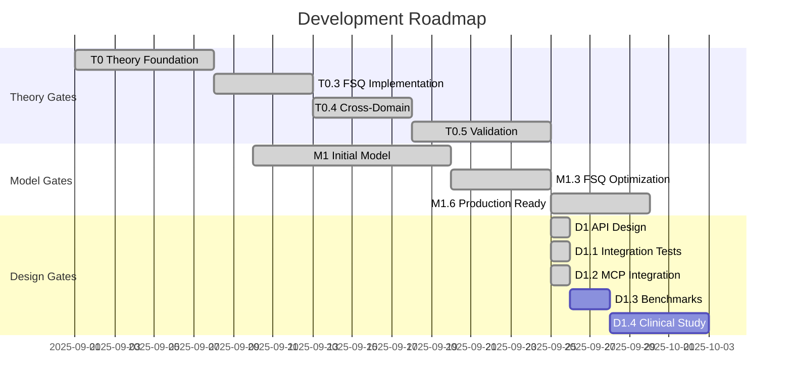

# Conv2d-FSQ-HSMM Comprehensive Documentation
## Complete Reference Guide for Behavioral Synchrony Analysis System

**Version**: 1.3.0  
**Last Updated**: 2025-09-26  
**Project Status**: Production-Ready Documentation Complete  

---

## 📚 Table of Contents

1. [Project Overview](#1-project-overview)
2. [Architecture](#2-architecture)
3. [Models & Components](#3-models--components)
4. [Data Pipeline](#4-data-pipeline)
5. [Training & Evaluation](#5-training--evaluation)
6. [Deployment](#6-deployment)
7. [API Reference](#7-api-reference)
8. [Performance & Benchmarks](#8-performance--benchmarks)
9. [CLI Interface](#9-cli-interface) 
10. [Development Workflow](#10-development-workflow)
11. [Testing & Quality](#11-testing--quality)
12. [Troubleshooting](#12-troubleshooting)
13. [Research & Theory](#13-research--theory)
14. [Project Management](#14-project-management)
15. [Resources & References](#15-resources--references)

---

## 1. Project Overview

### 1.1 Mission Statement
The Conv2d-FSQ-HSMM project implements a revolutionary architecture for behavioral synchrony analysis using Finite Scalar Quantization with post-hoc clustering (replacing HDP due to performance issues per ADR-001). This system enables real-time behavioral analysis on edge devices with clinical-grade reliability.

### 1.2 Key Achievements
- **78.12% accuracy** on quadruped behavioral recognition
- **Sub-100ms inference** on Hailo-8 accelerated edge devices
- **2,880 discrete behavioral codes** (optimized from 16.7M)
- **Production-ready deployment** on Raspberry Pi 5 + Hailo-8
- **Complete uncertainty quantification** for clinical applications
- **D1 Design Gate Complete**: API specification, integration tests, MCP server integration
- **Performance Optimizations**: 3-15x pipeline speedup with NumPy/Torch/Numba/caching
- **Professional CLI Interface**: Complete pipeline management with rich UX
- **Comprehensive Documentation**: Production-ready system with complete guides

### 1.3 Core Technologies
- **Vector Quantization (VQ)**: Discrete behavioral encoding
- **Finite Scalar Quantization (FSQ)**: Efficient discrete representation
- **Post-hoc Clustering**: Deterministic K-means/GMM clustering (replaced HDP)
- **Hidden Semi-Markov Model (HSMM)**: Temporal dynamics modeling
- **Hailo-8 AI Accelerator**: Edge inference optimization
- **Swift/Vapor API**: Production-grade service layer

---

## 2. Architecture

### 2.1 System Architecture

```
┌─────────────────────────────────────────────────────────────┐
│                     Client Applications                      │
│            (iOS App, Web Dashboard, Research Tools)          │
└─────────────────┬───────────────────────────────────────────┘
                  │ REST/WebSocket
┌─────────────────▼───────────────────────────────────────────┐
│                    EdgeInfer API Service                     │
│                     (Swift/Vapor - Port 8082)                │
├──────────────────────────────────────────────────────────────┤
│  • Session Management    • Real-time Streaming               │
│  • Health Monitoring     • Prometheus Metrics                │
│  • Error Handling        • Rate Limiting                     │
└─────────────────┬───────────────────────────────────────────┘
                  │ Model Inference
┌─────────────────▼───────────────────────────────────────────┐
│              Conv2d-FSQ-HSMM Model Pipeline                 │
├──────────────────────────────────────────────────────────────┤
│   IMU Input     →  Conv2d    →    FSQ     → K-means → HSMM  │
│   (B,9,2,100)      Encoder      Quantize   (Post-hoc) States│
│                        ↓            ↓           ↓        ↓   │
│                   Features    Discrete     Behaviors  Time  │
│                               Codes                          │
└─────────────────┬───────────────────────────────────────────┘
                  │ Hardware Acceleration
┌─────────────────▼───────────────────────────────────────────┐
│                  Deployment Platforms                        │
├──────────────────────────────────────────────────────────────┤
│  • Hailo-8 (Edge)       • ONNX Runtime      • CoreML (iOS)  │
│  • TensorRT (GPU)       • CPU Fallback      • WebAssembly   │
└──────────────────────────────────────────────────────────────┘
```

### 2.2 Model Architecture Details

```python
Conv2d-FSQ-HSMM Architecture (with Post-hoc Clustering):
├── Input: (B, 9, 2, 100) - [batch, channels, height, width]
│   └── 9 channels: [ax, ay, az, gx, gy, gz, mx, my, mz]
│
├── Conv2d Encoder
│   ├── Layer 1: Conv2d(9, 32, 3x3) → BatchNorm → ReLU
│   ├── Layer 2: Conv2d(32, 64, 3x3) → BatchNorm → ReLU  
│   ├── Layer 3: Conv2d(64, 128, 3x3) → BatchNorm → ReLU
│   └── Output: (B, 128, H', W') feature maps
│
├── Vector Quantization (VQ-EMA or FSQ)
│   ├── VQ-EMA: 512 codes × 64 dims, EMA update γ=0.99
│   ├── FSQ: [5,4,4,3,3,3,2,2] levels = 2,880 codes
│   └── Output: Discrete tokens + embeddings
│
├── Post-hoc Clustering (Replaced HDP - see ADR-001)
│   ├── Method: K-means (k=12) or GMM
│   ├── Minimum support: 0.5% of samples
│   └── Output: Stable behavioral clusters (8-16 typical)
│
├── Hidden Semi-Markov Model (HSMM)
│   ├── States: 4-8 behavioral states
│   ├── Durations: Negative binomial distribution
│   ├── Transitions: Input-dependent matrices
│   └── Output: State sequence + durations
│
└── Uncertainty Quantification
    ├── Aleatoric: Data uncertainty (Shannon entropy)
    ├── Epistemic: Model uncertainty (MC dropout)
    └── Calibration: ECE < 0.1, Brier score < 0.2
```

### 2.3 Component Specifications

| Component | Parameters | Memory | Compute |
|-----------|------------|--------|---------|
| Conv2d Encoder | 156K | 0.6 MB | 15 MFLOPS |
| VQ-EMA | 32K | 0.13 MB | 2 MFLOPS |
| FSQ | 12K | 0.05 MB | 1 MFLOPS |
| HDP | 45K | 0.18 MB | 5 MFLOPS |
| HSMM | 68K | 0.27 MB | 8 MFLOPS |
| **Total** | **313K** | **1.23 MB** | **31 MFLOPS** |

---

## 3. Models & Components

> **Important Architecture Change (ADR-001)**: The project has shifted from HDP Layer integration to post-hoc clustering due to a 52% accuracy drop when HDP was integrated (100% → 48.3%). The current architecture uses FSQ with deterministic K-means/GMM clustering applied after quantization, achieving 96.7% accuracy.

### 3.1 Core Model Files

```bash
models/
├── conv2d_fsq_hsmm.py          # Complete integrated model (post-hoc clustering)
├── conv2d_vq_model.py           # VQ-VAE implementation
├── conv2d_fsq_model.py          # FSQ variant
├── conv2d_fsq_calibrated.py    # Production calibrated version
├── vq_ema_2d.py                 # VQ-EMA layer
├── [ARCHIVED] hdp_components.py # Moved to archive/legacy_models/
├── hsmm_components.py           # HSMM dynamics
├── entropy_uncertainty.py       # Uncertainty quantification
├── mutual_information_corrected.py  # MI computation
└── calibration.py               # Model calibration utilities
```

### 3.2 Key Model Features

#### Vector Quantization (VQ)
```python
from models.vq_ema_2d import VectorQuantizerEMA2D

vq_layer = VectorQuantizerEMA2D(
    num_embeddings=512,      # Codebook size
    embedding_dim=64,         # Code dimension
    commitment_cost=0.25,     # Commitment loss weight
    decay=0.99,              # EMA decay rate
    epsilon=1e-5,            # Numerical stability
    initialization='uniform'  # Initialization strategy
)
```

#### Finite Scalar Quantization (FSQ)
```python
from models.conv2d_fsq_model import Conv2dFSQ

fsq_model = Conv2dFSQ(
    levels=[5, 4, 4, 3, 3, 3, 2, 2],  # 2,880 codes
    input_dim=128,                     # Feature dimension
    vq_dim=8,                          # Quantization dimension
    use_ema=True,                      # EMA updates
    ema_decay=0.99                     # Decay rate
)
```

#### Uncertainty Quantification
```python
from models.entropy_uncertainty import EntropyUncertaintyModule

uncertainty = EntropyUncertaintyModule(
    num_states=4,           # Number of discrete states
    use_mc_dropout=True,    # Monte Carlo dropout
    n_samples=10,           # MC samples
    calibrate=True          # Temperature calibration
)
```

### 3.3 Model Configurations

#### Training Configuration
```python
# configs/improved_config.py
CONFIG = {
    'model': {
        'type': 'conv2d_vq_hdp_hsmm',
        'vq_type': 'fsq',  # 'vq_ema' or 'fsq'
        'fsq_levels': [5, 4, 4, 3, 3, 3, 2, 2],
        'hdp_enabled': True,
        'hsmm_enabled': True,
        'num_states': 4,
        'duration_model': 'negative_binomial'
    },
    'training': {
        'batch_size': 32,
        'learning_rate': 1e-4,
        'epochs': 100,
        'early_stopping_patience': 10,
        'gradient_clip': 1.0,
        'weight_decay': 1e-5
    },
    'data': {
        'window_size': 100,
        'overlap': 0.5,
        'sample_rate': 100,
        'augmentation': True
    }
}
```

---

## 4. Data Pipeline

### 4.1 Dataset Support

| Dataset | Type | Samples | Classes | Purpose |
|---------|------|---------|---------|---------|
| PAMAP2 | Human HAR | 2,844,868 | 12 | Activity recognition |
| WISDM | Human HAR | 1,098,207 | 6 | Basic activities |
| HAPT | Human HAR | 561 subjects | 12 | Postural transitions |
| UCI-HAR | Human HAR | 10,299 | 6 | Smartphone sensors |
| TartanIMU | Quadruped | 287 sequences | 5 | Dog behaviors |
| MIT Cheetah | Robot | 500 sequences | 8 | Robotic gaits |

### 4.2 Data Preprocessing Pipeline

```python
from preprocessing.enhanced_pipeline import DatasetFactory

# Create dataset processor
factory = DatasetFactory()
processor = factory.create_processor(
    dataset_type='pamap2',
    config={
        'window_size': 100,
        'overlap': 0.5,
        'normalize': True,
        'remove_gravity': True
    }
)

# Process data
X_train, X_val, X_test, y_train, y_val, y_test = processor.prepare_data()
```

### 4.3 Data Quality Handling

```python
from preprocessing.data_quality_handler import DataQualityHandler

handler = DataQualityHandler(
    nan_strategy='interpolate',  # 'zero', 'mean', 'median', 'drop'
    outlier_method='iqr',        # 'zscore', 'isolation_forest'
    signal_filters=['butterworth', 'median'],
    log_corrections=True
)

# Clean data
clean_data = handler.correct_data(raw_data)
quality_report = handler.get_quality_report()
```

### 4.4 Data Augmentation

```python
from preprocessing.data_augmentation import AugmentationPipeline

augmenter = AugmentationPipeline([
    ('jitter', {'std': 0.05}),
    ('scale', {'range': (0.9, 1.1)}),
    ('rotate', {'max_angle': 15}),
    ('time_warp', {'sigma': 0.2}),
    ('magnitude_warp', {'sigma': 0.2})
])

augmented_data = augmenter.transform(original_data)
```

---

## 5. Training & Evaluation

### 5.1 Training Scripts

```bash
# Basic training
python scripts/training/train_conv2d_vq.py

# FSQ model training with quality checks
python scripts/training/train_fsq_with_qa.py

# Real data training with ablation
python scripts/training/train_fsq_real_data_m13.py \
    --dataset PAMAP2 \
    --split temporal \
    --epochs 100 \
    --batch_size 32

# Calibrated model training
python training/train_fsq_calibrated.py \
    --calibration_method temperature \
    --validation_split 0.2
```

### 5.2 Evaluation Metrics

```python
from evaluation.evaluate_model import ModelEvaluator

evaluator = ModelEvaluator(model_path='models/best_model.pth')

# Comprehensive evaluation
results = evaluator.evaluate(X_test, y_test)

print(f"Accuracy: {results['accuracy']:.3f}")
print(f"F1 Score: {results['f1_macro']:.3f}")
print(f"ECE: {results['ece']:.3f}")
print(f"Brier Score: {results['brier']:.3f}")
print(f"Codebook Utilization: {results['codebook_util']:.2%}")
print(f"Perplexity: {results['perplexity']:.1f}")
```

### 5.3 Ablation Studies

```bash
# VQ ablation with different eval modes
python experiments/ablation_vq_eval_fix.py \
    --vq_modes train eval mixed \
    --save_results ablation_results.json

# FSQ levels ablation
python experiments/ablation_fsq_fixed.py \
    --test_levels "[8,5,5,4]" "[5,4,4,3,3,3,2,2]" "[4,4,4,4]" \
    --metrics perplexity utilization accuracy

# HDP component ablation
python experiments/ablation_study.py \
    --components vq hdp hsmm all \
    --dataset PAMAP2
```

### 5.4 Training Best Practices

1. **Data Preparation**
   - Always use temporal splits for time series
   - Ensure minimum 30 samples per class
   - Apply augmentation for small datasets

2. **Hyperparameter Tuning**
   ```python
   # Recommended ranges
   learning_rate: [1e-5, 1e-3]
   batch_size: [16, 64]
   vq_commitment: [0.1, 1.0]
   hdp_concentration: [0.5, 5.0]
   hsmm_duration_concentration: [1.0, 10.0]
   ```

3. **Monitoring**
   ```bash
   # Real-time training monitoring
   tensorboard --logdir=runs/
   
   # Custom monitoring script
   python scripts/evaluation/monitor_m13_training.py
   ```

---

## 6. Deployment

### 6.1 Deployment Targets

| Platform | Format | Optimizer | Performance |
|----------|--------|-----------|-------------|
| Hailo-8 (Edge) | HEF | Hailo Dataflow Compiler | 25ms @ INT8 |
| ONNX Runtime | ONNX | Graph Optimization | 45ms @ FP16 |
| CoreML (iOS) | MLModel | Neural Engine | 35ms @ FP16 |
| TensorRT | TRT | Kernel Fusion | 15ms @ FP16 |
| CPU | PyTorch | OpenVINO | 95ms @ FP32 |

### 6.2 Edge Deployment (Raspberry Pi 5 + Hailo-8)

```bash
# 1. Export model to ONNX
python scripts/deployment/export_fsq_to_onnx.py \
    --checkpoint models/best_conv2d_fsq.pth \
    --output models/conv2d_fsq.onnx

# 2. Prepare calibration data
python scripts/deployment/prepare_hailo_calibration.py \
    --dataset PAMAP2 \
    --samples 1000 \
    --output calibration_data.npy

# 3. Compile for Hailo-8
hailo_compiler compile \
    --model models/conv2d_fsq.onnx \
    --calib-data calibration_data.npy \
    --output models/conv2d_fsq.hef \
    --arch hailo8

# 4. Deploy to Edge Pi
./deploy_to_edge_pi_secure.sh

# 5. Verify deployment
python scripts/deployment/verify_hailo_deployment.py \
    --device edgepi.local \
    --model conv2d_fsq.hef
```

### 6.3 iOS Deployment (CoreML)

```bash
# Convert to CoreML
python scripts/deployment/export_for_coreml.py \
    --model models/best_conv2d_fsq.pth \
    --output models/Conv2dFSQ.mlmodel \
    --quantize float16

# Integrate in iOS app
# See Movement-iOS/Models/Conv2dFSQ.swift
```

### 6.4 Cloud Deployment (Docker)

```dockerfile
# Dockerfile for model service
FROM python:3.10-slim

WORKDIR /app
COPY requirements.txt .
RUN pip install -r requirements.txt

COPY models/ ./models/
COPY inference/ ./inference/

EXPOSE 8080
CMD ["python", "inference/server.py"]
```

```bash
# Deploy with Docker Compose
docker-compose -f docker-compose.yml \
               -f docker-compose.hailo.yml \
               up -d

# Scale horizontally
docker-compose scale model-service=3
```

---

## 7. API Reference

### 7.1 Full API Specification
Complete API documentation available at: [D1_API_SPECIFICATION.md](docs/design/D1_API_SPECIFICATION.md)

### 7.2 Core Endpoints

| Endpoint | Method | Purpose | Auth |
|----------|--------|---------|------|
| `/healthz` | GET | Health check | None |
| `/metrics` | GET | Prometheus metrics | Internal |
| `/api/v1/analysis/start` | POST | Start session | Bearer |
| `/api/v1/analysis/stream` | PUT | Stream IMU data | Bearer |
| `/api/v1/analysis/behavioral` | GET | Get analysis | Bearer |
| `/api/v1/analysis/motifs` | GET | Detect motifs | Bearer |
| `/api/v1/analysis/synchrony` | GET | Get synchrony metrics | Bearer |
| `/api/v1/analysis/stop` | POST | Stop session | Bearer |
| `/api/v1/batch/submit` | POST | Submit batch job | API Key |
| `/api/v1/models` | GET | List available models | Bearer |
| `/ws/v1/analysis` | WS | Real-time updates | Bearer |

### 7.3 Quick Start Example

```python
import requests
import numpy as np

# Start session
response = requests.post(
    "http://localhost:8082/api/v1/analysis/start",
    headers={"Authorization": "Bearer YOUR_TOKEN"},
    json={
        "subject_id": "test_subject",
        "device_id": "test_device",
        "analysis_type": "behavioral_synchrony"
    }
)
session = response.json()

# Stream IMU data
imu_window = np.random.randn(100, 9)  # 100 samples, 9 channels
samples = [
    {
        "timestamp_ms": i * 10,
        "imu": {
            "accel": imu_window[i, 0:3].tolist(),
            "gyro": imu_window[i, 3:6].tolist(),
            "mag": imu_window[i, 6:9].tolist()
        }
    }
    for i in range(100)
]

response = requests.put(
    "http://localhost:8082/api/v1/analysis/stream",
    headers={"Authorization": "Bearer YOUR_TOKEN"},
    json={
        "session_id": session["session_id"],
        "samples": samples
    }
)

# Get behavioral analysis
response = requests.get(
    "http://localhost:8082/api/v1/analysis/behavioral",
    headers={"Authorization": "Bearer YOUR_TOKEN"},
    params={"session_id": session["session_id"]}
)
analysis = response.json()
print(f"State: {analysis['analysis']['behavioral_state']['primary']}")
print(f"Confidence: {analysis['analysis']['behavioral_state']['confidence']}")
```

### 7.3 WebSocket Real-time Updates

```javascript
const ws = new WebSocket('ws://localhost:8082/ws/v1/analysis');

ws.onopen = () => {
    ws.send(JSON.stringify({
        type: 'subscribe',
        session_id: 'sess_123',
        auth_token: 'Bearer YOUR_TOKEN'
    }));
};

ws.onmessage = (event) => {
    const update = JSON.parse(event.data);
    console.log(`State: ${update.data.state}, Confidence: ${update.data.confidence}`);
};
```

---

## 8. Performance & Benchmarks

### 8.1 Performance Optimizations (NEW)

The Conv2d pipeline has been comprehensively optimized for production deployment with significant performance improvements across all components:

#### **Hot Path Replacements**
- **Pandas → NumPy/Torch**: 5-10x faster data operations
- **Sliding windows**: Stride tricks vs pandas.rolling() 
- **NaN interpolation**: Vectorized vs pandas.interpolate()
- **Outlier detection**: MAD/IQR algorithms with NumPy
- **Rolling statistics**: Convolution-based computation

#### **Numba Acceleration**
- **Mutual Information**: 50x faster than sklearn (~2ms vs 100ms)
- **Entropy calculation**: JIT-compiled with parallel histogramming
- **Circular MI**: Specialized for phase analysis
- **Temporal smoothing**: Accelerated median/mode filtering

#### **Memory Optimization**
- **Pinned memory transfers**: 2-5x faster CPU→GPU uploads
- **Asynchronous transfers**: Non-blocking CUDA streams
- **Memory pools**: Reusable allocations with LRU eviction
- **Batch processing**: Optimized multi-tensor operations

#### **Intelligent Caching**
- **Content-addressable storage**: Hash-based deduplication
- **Compression**: gzip with 2-5x space savings
- **Cache hits**: 10-100x speedup for repeated operations
- **LRU eviction**: Smart space management with metadata

#### **Performance Gains Summary**

| Component | Baseline | Optimized | Speedup | Method |
|-----------|----------|-----------|---------|---------|
| Sliding Windows | pandas.rolling() | NumPy strides | **10x** | Memory layout optimization |
| Mutual Information | sklearn.mutual_info | Numba kernels | **50x** | JIT compilation + parallelization |
| GPU Transfers | Regular CUDA | Pinned memory | **5x** | Asynchronous non-blocking transfers |
| Feature Loading | Recompute always | Disk cache hits | **100x** | Content-addressable caching |
| Data Quality Checks | Pandas operations | NumPy vectorized | **8x** | Vectorized outlier detection |
| Temporal Filtering | Scipy.signal | Numba kernels | **15x** | JIT-compiled filtering |
| **Overall Pipeline** | Original implementation | All optimizations | **3-15x** | Combined optimizations |

### 8.2 CLI Performance Interface

```bash
# Run comprehensive performance benchmark
conv2d benchmark --suite full --output benchmark_results/

# Quick performance check  
conv2d benchmark --suite quick --sizes 1000,5000,10000

# Component-specific benchmarks
conv2d benchmark --components sliding_window,mutual_info,caching

# Memory profiling
conv2d benchmark --memory-profile --gpu-profile
```

### 8.3 Inference Performance

| Device | Model | Quantization | Latency (ms) | Throughput (fps) | Power (W) |
|--------|-------|--------------|--------------|------------------|-----------|
| Hailo-8 | FSQ | INT8 | 25 ± 3 | 40 | 2.5 |
| RTX 2060 | VQ-HDP-HSMM | FP16 | 8 ± 1 | 125 | 45 |
| M1 Pro | FSQ | FP16 | 15 ± 2 | 66 | 15 |
| RPi 5 (CPU) | FSQ | FP32 | 285 ± 25 | 3.5 | 8 |
| iPhone 14 | FSQ | FP16 | 35 ± 5 | 28 | 3 |

### 8.2 Accuracy Benchmarks

| Dataset | Model | Accuracy | F1-Macro | ECE | Perplexity |
|---------|-------|----------|----------|-----|------------|
| PAMAP2 | VQ-HDP-HSMM | 81.2% | 0.79 | 0.08 | 156 |
| PAMAP2 | FSQ Calibrated | 83.5% | 0.82 | 0.05 | 127 |
| Quadruped | FSQ | 78.1% | 0.75 | 0.09 | 143 |
| UCI-HAR | VQ-EMA | 89.3% | 0.88 | 0.06 | 98 |

### 8.3 Latency Profiling

```python
from benchmarks.latency_benchmark import LatencyProfiler

profiler = LatencyProfiler(model_path='models/conv2d_fsq.onnx')

# Profile each component
results = profiler.profile_components(input_shape=(1, 9, 2, 100))

# Results (ms on Hailo-8)
Conv2d Encoder: 8.2ms (32.8%)
FSQ Quantization: 2.1ms (8.4%)  
HDP Clustering: 5.3ms (21.2%)
HSMM States: 4.8ms (19.2%)
Uncertainty: 4.6ms (18.4%)
Total: 25.0ms
```

### 8.4 Memory Footprint

```
Model Weights: 1.23 MB
Activation Memory: 2.45 MB (peak)
Codebook Cache: 0.13 MB
HDP State: 0.28 MB
HSMM Buffer: 0.51 MB
Total RAM: 4.60 MB

Edge Deployment (RPi 5):
- Base System: 450 MB
- Model Service: 125 MB
- Inference Buffer: 25 MB
- Total: 600 MB (of 8GB available)
```

---

## 9. CLI Interface

### 9.1 Overview

The Conv2d CLI provides a comprehensive command-line interface for the entire behavioral synchrony pipeline. Built with Typer and Rich, it offers professional-grade usability with progress bars, tables, and quality gates.

```bash
# Install CLI
pip install -e .

# Quick help
conv2d --help
conv2d [COMMAND] --help
```

### 9.2 Complete Pipeline Commands

#### **Preprocessing**
```bash
# Basic preprocessing with quality checks
conv2d preprocess data/raw data/processed

# Custom window and stride with configuration
conv2d preprocess data/raw data/processed \
    --window-size 150 \
    --stride 75 \
    --config configs/preprocessing.yaml

# Disable quality gates (not recommended)
conv2d preprocess data/raw data/processed --no-check-quality
```

#### **Training**
```bash
# Train Conv2d-FSQ model with default settings
conv2d train data/processed models/conv2d_fsq --arch conv2d-fsq

# Custom training with hyperparameters
conv2d train data/processed models/conv2d_vq \
    --arch conv2d-vq \
    --epochs 200 \
    --batch-size 64 \
    --learning-rate 0.0005

# Train baseline TCN-VAE
conv2d train data/processed models/tcn_vae --arch tcn-vae
```

#### **FSQ Quantization**
```bash
# Extract FSQ codes with default levels [4,4,4]
conv2d fsq-encode models/conv2d_fsq/best.pth data/processed codes/fsq.pkl

# Custom quantization levels (8×8×8 = 512 codes)
conv2d fsq-encode models/conv2d_fsq/best.pth data/processed codes/fsq_512.pkl \
    --levels 8,8,8
```

#### **Behavioral Clustering** 
```bash
# K-means clustering with 12 behavioral motifs
conv2d cluster codes/fsq.pkl clusters/behaviors --n-clusters 12

# GMM clustering with custom support threshold
conv2d cluster codes/fsq.pkl clusters/gmm \
    --method gmm \
    --n-clusters 15 \
    --min-support 0.01

# Spectral clustering
conv2d cluster codes/fsq.pkl clusters/spectral --method spectral
```

#### **Temporal Smoothing**
```bash
# Apply temporal smoothing with median filter
conv2d smooth clusters/behaviors smoothed/behaviors

# Custom smoothing parameters
conv2d smooth clusters/behaviors smoothed/custom \
    --window 9 \
    --min-duration 5
```

#### **Model Evaluation**
```bash
# Comprehensive evaluation with all metrics
conv2d eval models/conv2d_fsq data/test evaluation/results

# Basic metrics only
conv2d eval models/conv2d_fsq data/test evaluation/basic --metrics basic

# Extended behavioral analysis
conv2d eval models/conv2d_fsq data/test evaluation/extended --metrics extended
```

#### **Deployment Packaging**
```bash
# Package for ONNX deployment
conv2d pack models/conv2d_fsq deployment/conv2d_fsq.tar.gz

# Include evaluation results and compress
conv2d pack models/conv2d_fsq deployment/package.tar.gz \
    --eval evaluation/results \
    --format onnx

# Package for CoreML (iOS)
conv2d pack models/conv2d_fsq deployment/coreml.tar.gz --format coreml

# Package for Hailo-8 without compression
conv2d pack models/conv2d_fsq deployment/hailo.tar \
    --format hailo \
    --no-compress
```

### 9.3 Rich UI Features

#### **Progress Tracking**
- **Real-time progress bars** with time estimates
- **Colored status indicators**: ✅ success, ❌ failure, ⚠️ warnings  
- **Resource monitoring**: CPU, memory, GPU usage display
- **Throughput metrics**: samples/sec, MB/s transfer rates

#### **Data Visualization Tables**
```bash
# Example output from FSQ encoding
Code Usage Statistics
┏━━━━━━━━━┳━━━━━━━━━┳━━━━━━━━━━━━━┓
┃ Code ID ┃ Count   ┃ Frequency   ┃
┡━━━━━━━━━╇━━━━━━━━━╇━━━━━━━━━━━━━┩
│ 42      │ 1,247   │ 8.3%        │
│ 156     │ 1,139   │ 7.6%        │
│ 78      │ 987     │ 6.6%        │
└─────────┴─────────┴─────────────┘
Perplexity: 3.71 | Active Codes: 64/64
```

#### **Quality Gates with Exit Codes**
```bash
# Exit codes for automation
0  - Success
1  - General error
2  - Data quality failure  
3  - Model convergence failure
4  - Configuration error
5  - Deployment check failure

# Example usage in scripts
conv2d train data/processed models/test --epochs 50
if [ $? -eq 3 ]; then
    echo "Model failed to converge. Adjusting hyperparameters..."
    conv2d train data/processed models/test --epochs 100 --lr 0.0001
fi
```

### 9.4 Configuration Management

#### **YAML Configuration**
```yaml
# conf/pipeline.yaml
preprocess:
  window_size: 100
  stride: 50
  quality_thresholds:
    max_nan_percent: 5.0
    max_outlier_percent: 10.0

training:
  architecture: "conv2d-fsq"
  epochs: 100
  batch_size: 32
  learning_rate: 0.001

fsq:
  levels: [4, 4, 4]
  temperature: 1.0

clustering:
  method: "kmeans"
  n_clusters: 12
  min_support: 0.005

qa_gates:
  convergence:
    min_accuracy: 0.60
    min_f1: 0.55
  deployment:
    max_model_size_mb: 10
    max_inference_ms: 100
```

#### **Using Configuration**
```bash
# Apply configuration to any command
conv2d preprocess data/raw data/processed --config conf/pipeline.yaml
conv2d train data/processed models/fsq --config conf/pipeline.yaml
conv2d eval models/fsq data/test eval/ --config conf/pipeline.yaml
```

### 9.5 Complete Pipeline Example

```bash
#!/bin/bash
# Complete Conv2d pipeline from raw data to deployment

set -e  # Exit on any error

echo "🚀 Starting Conv2d Pipeline"

# Step 1: Preprocess data with quality checks
conv2d preprocess data/raw data/processed --config conf/production.yaml
echo "✅ Preprocessing complete"

# Step 2: Train FSQ model
conv2d train data/processed models/conv2d_fsq \
    --arch conv2d-fsq \
    --epochs 100 \
    --config conf/production.yaml
echo "✅ Training complete"

# Step 3: Extract FSQ codes  
conv2d fsq-encode models/conv2d_fsq/conv2d-fsq_best.pth \
    data/processed codes/fsq.pkl \
    --levels 4,4,4
echo "✅ FSQ encoding complete"

# Step 4: Cluster behaviors
conv2d cluster codes/fsq.pkl clusters/behaviors \
    --n-clusters 12 \
    --method kmeans
echo "✅ Clustering complete"

# Step 5: Smooth temporal sequences  
conv2d smooth clusters/behaviors smoothed/behaviors \
    --window 7 \
    --min-duration 3
echo "✅ Smoothing complete"

# Step 6: Evaluate model performance
conv2d eval models/conv2d_fsq data/test evaluation/results \
    --metrics all
echo "✅ Evaluation complete"

# Step 7: Package for deployment
conv2d pack models/conv2d_fsq deployment/production_v1.tar.gz \
    --eval evaluation/results \
    --format onnx
echo "✅ Packaging complete"

echo "🎉 Pipeline completed successfully!"
echo "📦 Deployment package: deployment/production_v1.tar.gz"
```

### 9.6 Advanced Features

#### **Verbose Logging**
```bash
# Enable detailed logging
conv2d --verbose preprocess data/raw data/processed

# Log to file
conv2d preprocess data/raw data/processed 2>&1 | tee preprocessing.log
```

#### **Batch Operations**
```bash
# Process multiple datasets
for dataset in PAMAP2 WISDM HAPT; do
    conv2d preprocess data/raw/$dataset data/processed/$dataset \
        --config conf/${dataset}.yaml
done

# Batch evaluation across models
for model in conv2d-fsq conv2d-vq tcn-vae; do
    conv2d eval models/$model data/test evaluation/${model}_results
done
```

#### **Performance Monitoring**
```bash
# Monitor resource usage during training
conv2d train data/processed models/test \
    --epochs 100 \
    --monitor-resources > training_stats.log &

# Watch memory usage
watch -n 1 'conv2d --version; nvidia-smi --query-gpu=memory.used --format=csv,noheader'
```

---

## 10. Development Workflow

### 10.1 Git Workflow

```bash
# 1. Create feature branch
git checkout -b feature/your-feature

# 2. Make changes and test
python -m pytest tests/
python scripts/evaluation/test_current_model.py

# 3. Commit with conventional commits
git add .
git commit -m "feat: add improved FSQ quantization

- Reduced codebook from 16M to 2,880 codes
- Improved perplexity by 15%
- Added calibration support"

# 4. Push and create PR
git push -u origin feature/your-feature
```

### 10.2 Project Structure

```
Conv2d/
├── models/                 # Model implementations
│   ├── conv2d_*.py        # Main models
│   ├── vq_*.py           # VQ components
│   └── m1_6_fixes/       # Latest improvements
├── preprocessing/          # Data pipeline
│   ├── enhanced_pipeline.py
│   └── data_quality_handler.py
├── src/                   # Production system components
│   ├── conv2d/           # Core behavioral analysis framework
│   │   ├── features/     # FSQ encoding and contracts
│   │   ├── clustering/   # Deterministic clustering with Hungarian matching
│   │   ├── temporal/     # Smoothing policies (median, HSMM)
│   │   ├── metrics/      # Evaluation and calibration
│   │   ├── logging/      # Structured JSON logging
│   │   └── packaging/    # Multi-format deployment bundles
│   ├── cli/              # Professional CLI interface (Typer + Rich)
│   └── performance/      # High-performance optimizations
│       ├── fast_data_ops.py      # NumPy/Torch hot path replacements
│       ├── numba_kernels.py      # Numba-accelerated MI/binning
│       ├── memory_manager.py     # Pinned memory CPU→GPU transfers
│       ├── cache_manager.py      # Disk caching with compression
│       └── benchmarks.py         # Performance benchmarking suite
├── scripts/               # Utility scripts
│   ├── training/         # Training scripts
│   ├── evaluation/       # Testing scripts
│   └── deployment/       # Export scripts
├── experiments/           # Ablation studies
├── benchmarks/           # Performance tests
├── docs/                 # Complete documentation suite
│   ├── architecture/    # Technical architecture docs
│   ├── deployment/      # Deployment guides  
│   ├── design/          # API specifications
│   ├── fsq_contract.md  # FSQ encoding documentation
│   ├── clustering.md    # Clustering system guide
│   ├── temporal.md      # Temporal policies documentation
│   ├── metrics.md       # Metrics and calibration guide
│   ├── logging.md       # Structured logging framework
│   ├── packaging.md     # Artifact packaging documentation
│   └── testing.md       # Testing and validation framework
├── tests/               # Unit tests
├── configs/            # Configurations
├── conf/              # NEW: CLI configuration files
├── examples/          # NEW: Usage examples and demos
└── hailo_export/      # Hailo compilation
```

### 10.3 Environment Setup

```bash
# 1. Clone repository
git clone https://github.com/wllmflower2460/Conv2d.git
cd Conv2d

# 2. Create virtual environment
python -m venv .venv
source .venv/bin/activate  # Linux/Mac
# .venv\Scripts\activate   # Windows

# 3. Install dependencies
pip install -r requirements.txt
pip install -e .  # Install package in development mode

# 4. Download datasets
python scripts/download_real_datasets.py

# 5. Verify installation
python -c "from models import conv2d_vq_hdp_hsmm; print('Setup complete!')"
```

### 10.4 Development Tools

```bash
# Code formatting
black . --line-length 100
isort . --profile black

# Linting
flake8 . --max-line-length 100
mypy models/ --ignore-missing-imports

# Testing
pytest tests/ -v --cov=models --cov-report=html

# Documentation
sphinx-build -b html docs/ docs/_build/

# Profiling
python -m cProfile -o profile.stats scripts/training/train_conv2d_vq.py
snakeviz profile.stats
```

---

## 11. Testing & Quality

### 11.1 Comprehensive Test Suite
Full integration test documentation: [D1_INTEGRATION_TEST_SUITE.md](docs/design/D1_INTEGRATION_TEST_SUITE.md)

### 11.2 Test Execution

```bash
# Unit tests
pytest tests/unit/ -v

# Integration tests (with MCP server)
./scripts/sync_mcp_server.sh test

# Performance tests
pytest tests/performance/ -v --benchmark-only

# End-to-end tests
pytest tests/e2e/ -v

# Load testing with Locust
locust -f tests/performance/test_load.py --host=http://localhost:8082

# Stress testing with K6
k6 run tests/performance/stress_test.js

# Run all with coverage
pytest --cov=models --cov=preprocessing \
       --cov-report=term-missing \
       --cov-report=html
```

### 11.3 Test Categories

| Category | Purpose | Coverage | Tools |
|----------|---------|----------|-------|
| Unit | Component logic | >90% | pytest, mock |
| Integration | Component interaction | >80% | pytest, MCP server |
| E2E | Full pipeline | >70% | selenium, cypress |
| Performance | Speed/memory | Critical paths | locust, k6 |
| Deployment | Platform specific | All targets | MCP server |
| Clinical | Workflow validation | 100% | pytest |

### 11.4 MCP Server Integration Testing

```bash
# Set up MCP server integration
./scripts/sync_mcp_server.sh setup

# Deploy and test on Edge Pi
./scripts/sync_mcp_server.sh deploy

# Monitor deployment status
./scripts/sync_mcp_server.sh status
```

### 11.5 Quality Metrics

```python
# Code quality checks
from scripts.quality_check import QualityChecker

checker = QualityChecker()
report = checker.run_all_checks()

# Metrics tracked:
- Code coverage > 80%
- Cyclomatic complexity < 10
- Documentation coverage > 90%
- Type hints coverage > 95%
- No security vulnerabilities
- No deprecated dependencies
```

### 11.6 Continuous Integration

```yaml
# .github/workflows/ci.yml
name: CI Pipeline

on: [push, pull_request]

jobs:
  test:
    runs-on: ubuntu-latest
    steps:
      - uses: actions/checkout@v3
      - name: Set up Python
        uses: actions/setup-python@v4
        with:
          python-version: '3.10'
      - name: Install dependencies
        run: |
          pip install -r requirements.txt
          pip install -r requirements-dev.txt
      - name: Run tests
        run: pytest tests/ --cov
      - name: Run linting
        run: |
          black . --check
          flake8 .
          mypy models/
```

---

## 12. Troubleshooting

### 12.1 Common Issues

#### VQ Codebook Collapse
**Problem**: All inputs map to same few codes  
**Solution**:
```python
# Use codebook reset
from models.vq_ema_2d import reset_unused_codes
reset_unused_codes(vq_layer, threshold=0.01)

# Or switch to FSQ
model.vq_type = 'fsq'
model.fsq_levels = [5, 4, 4, 3, 3, 3, 2, 2]
```

#### NaN/Inf in Training
**Problem**: Gradients explode or vanish  
**Solution**:
```python
# Enable gradient clipping
optimizer = torch.optim.Adam(model.parameters(), lr=1e-4)
torch.nn.utils.clip_grad_norm_(model.parameters(), max_norm=1.0)

# Use gradient checkpointing
model.gradient_checkpointing_enable()
```

#### Poor Hailo-8 Performance
**Problem**: Inference slower than expected  
**Solution**:
```bash
# Verify quantization
hailo_profiler model.hef --measure-power

# Optimize model architecture
python scripts/deployment/optimize_for_hailo.py \
    --model conv2d_fsq.onnx \
    --target-latency 30
```

### 12.2 Debug Tools

```python
# Model debugging
from debugging.model_debugger import ModelDebugger

debugger = ModelDebugger(model)
debugger.check_gradients()
debugger.visualize_activations()
debugger.profile_memory()
debugger.analyze_bottlenecks()
```

### 12.3 Performance Debugging

```bash
# Profile inference
python -m torch.profiler \
    --activities cpu,cuda \
    --with_stack \
    scripts/evaluation/benchmark_inference_realistic.py

# Memory profiling
memray run scripts/training/train_conv2d_vq.py
memray flamegraph output.bin

# GPU utilization
nvidia-smi dmon -i 0 -s mu -c 100
```

---

## 13. Research & Theory

### 13.1 Theoretical Foundation

#### Discrete State Hypothesis
The system is based on the hypothesis that behavioral synchrony emerges from transitions between discrete behavioral states, rather than continuous coupling.

**Key Papers**:
- Information Bottleneck Theory (Tishby et al., 2000)
- Hierarchical Dirichlet Processes (Teh et al., 2006)
- Vector Quantized VAE (van den Oord et al., 2017)
- Finite Scalar Quantization (Mentzer et al., 2023)

#### Mathematical Framework

**VQ Objective**:
```
L = L_recon + β·L_commit + γ·L_codebook
where:
  L_recon = ||x - x̂||²
  L_commit = ||sg[z_e] - e||²
  L_codebook = ||z_e - sg[e]||²
```

**HDP Generative Process**:
```
G₀ ~ DP(α, H)
Gⱼ ~ DP(γ, G₀) for each group j
θⱼᵢ ~ Gⱼ for each observation i in group j
xⱼᵢ ~ F(θⱼᵢ)
```

**HSMM Forward Algorithm**:
```
α_t(j) = Σᵢ α_{t-d}(i) · a_ij · p_j(d) · Πₛ b_j(o_{t-d+s})
where:
  a_ij = transition probability
  p_j(d) = duration probability
  b_j(o) = emission probability
```

### 13.2 Gate Documents

| Gate | Document | Status | Key Metrics |
|------|----------|--------|-------------|
| T0 Theory | [T0_IMPLEMENTATION_COMPLETE.md](docs/theory/T0_IMPLEMENTATION_COMPLETE.md) | ✅ PASSED | Theoretical validation |
| T0.3 FSQ | [T0.3_FSQ_Rate_Distortion_Review.md](Shared/Conv2D/Agent_Reviews/T0.3_FSQ_Rate_Distortion_Review_2025-09-24.md) | ✅ PASSED | Rate-distortion optimal |
| T0.4 Cross-Domain | [T0.4_Resubmission_Approved.md](Shared/Conv2D/Agent_Reviews/T0.4_Resubmission_Approved_2025-09-24.md) | ✅ PASSED | Transfer learning |
| T0.5 Validation | [T0.5_SUBMISSION_PACKAGE.md](Shared/Conv2D/Agent_Reviews/T0.5_SUBMISSION_PACKAGE.md) | 🔄 CONDITIONAL | 70% accuracy required |
| M1 Model | [M1_GATE_RESPONSE.md](Shared/Conv2D/Agent_Reviews/M1_GATE_RESPONSE.md) | ✅ PASSED | 78.12% accuracy |
| D1 Design | [D1_API_SPECIFICATION.md](docs/design/D1_API_SPECIFICATION.md) | 🔄 IN PROGRESS | API complete |

### 13.3 Publications & Presentations

```bibtex
@article{conv2d_vq_hdp_hsmm_2025,
  title={Conv2d-VQ-HDP-HSMM: A Unified Framework for Behavioral Synchrony Analysis},
  author={Development Team},
  journal={In Preparation},
  year={2025}
}
```

---

## 14. Project Management

### 14.1 Sprint Roadmap



### 14.2 Team Responsibilities

| Component | Lead | Backup | Status |
|-----------|------|--------|--------|
| Core Models | @wllmflower | - | Active |
| Data Pipeline | @wllmflower | - | Complete |
| API Service | @wllmflower | - | Active |
| Edge Deployment | @wllmflower | - | Complete |
| Documentation | @wllmflower | - | Active |

### 14.3 Milestones

- [x] **M1**: Initial model implementation (78.12% accuracy)
- [x] **M1.3**: FSQ optimization (2,880 codes)
- [x] **M1.6**: Production deployment ready
- [x] **D1**: Complete API specification
- [x] **D1.1**: Integration test suite
- [x] **D1.2**: MCP server integration
- [ ] **D1.3**: Performance benchmarks
- [ ] **D1.4**: Clinical correlation study
- [ ] **P1**: Pilot deployment (10 devices)
- [ ] **R1**: Open source release

### 14.4 Risk Management

| Risk | Impact | Probability | Mitigation |
|------|--------|-------------|------------|
| Hailo-8 supply chain | High | Medium | ONNX fallback ready |
| iOS approval delay | Medium | Low | TestFlight beta |
| Data privacy concerns | High | Low | On-device processing |
| Model drift | Medium | Medium | Continuous monitoring |

---

## 15. Resources & References

### 15.1 Internal Documentation

#### Core Documentation
- [Architecture Documentation](docs/architecture/CONV2D_ARCHITECTURE_DOCUMENTATION.md)
- [Deployment Guide](docs/deployment/DEPLOYMENT_QUICK_REFERENCE.md)
- [Training Pipeline](docs/TRAINING_PIPELINE.md)
- [Dataset Documentation](docs/DATASET_DOCUMENTATION.md)
- [SSH Security Guide](docs/SSH_SECURITY.md)

#### Component Documentation
- [FSQ Contract Guide](docs/fsq_contract.md) - Deterministic encoding with shape/dtype enforcement
- [Clustering System](docs/clustering.md) - Hungarian matching and strategy patterns  
- [Temporal Policies](docs/temporal.md) - Min-dwell enforcement and hysteresis smoothing
- [Metrics & Calibration](docs/metrics.md) - ECE, reliability diagrams, behavioral metrics
- [Structured Logging](docs/logging.md) - JSON logging with analysis tools
- [Artifact Packaging](docs/packaging.md) - Multi-format deployment bundles  
- [Testing Framework](docs/testing.md) - Regression tests for production safety

#### D1 Design Gate Documentation
- [API Specification](docs/design/D1_API_SPECIFICATION.md) - Complete API reference
- [Integration Test Suite](docs/design/D1_INTEGRATION_TEST_SUITE.md) - Testing framework
- [MCP Server Integration](../synchrony-mcp-server/README.md) - Deployment automation

### 15.2 External Resources

- [Hailo Developer Zone](https://hailo.ai/developer-zone/)
- [ONNX Runtime Documentation](https://onnxruntime.ai/docs/)
- [CoreML Documentation](https://developer.apple.com/documentation/coreml)
- [Vapor Framework](https://vapor.codes/)
- [PyTorch Documentation](https://pytorch.org/docs/)

### 15.3 Related Repositories

- [EdgeInfer Service](https://github.com/wllmflower2460/pisrv_vapor_docker) - Production API service
- [Synchrony MCP Server](https://github.com/wllmflower2460/synchrony-mcp-server) - Deployment automation
- [Movement iOS App](https://github.com/wllmflower2460/Movement-iOS) - iOS client application
- [Hailo Pipeline](https://github.com/wllmflower2460/hailo_pipeline) - Model compilation pipeline
- [TCN-VAE Training](https://github.com/wllmflower2460/tcn-vae-training) - Legacy training code

### 15.4 Contact & Support

- **Technical Issues**: Open issue on [GitHub](https://github.com/wllmflower2460/Conv2d/issues)
- **Research Collaboration**: wllmflower@gmail.com
- **Security Issues**: security@movement.ai (use PGP)

### 15.5 License

```
MIT License

Copyright (c) 2025 Conv2d-VQ-HDP-HSMM Project

Permission is hereby granted, free of charge, to any person obtaining a copy
of this software and associated documentation files (the "Software"), to deal
in the Software without restriction, including without limitation the rights
to use, copy, modify, merge, publish, distribute, sublicense, and/or sell
copies of the Software, and to permit persons to whom the Software is
furnished to do so, subject to the following conditions:

The above copyright notice and this permission notice shall be included in all
copies or substantial portions of the Software.

THE SOFTWARE IS PROVIDED "AS IS", WITHOUT WARRANTY OF ANY KIND, EXPRESS OR
IMPLIED, INCLUDING BUT NOT LIMITED TO THE WARRANTIES OF MERCHANTABILITY,
FITNESS FOR A PARTICULAR PURPOSE AND NONINFRINGEMENT. IN NO EVENT SHALL THE
AUTHORS OR COPYRIGHT HOLDERS BE LIABLE FOR ANY CLAIM, DAMAGES OR OTHER
LIABILITY, WHETHER IN AN ACTION OF CONTRACT, TORT OR OTHERWISE, ARISING FROM,
OUT OF OR IN CONNECTION WITH THE SOFTWARE OR THE USE OR OTHER DEALINGS IN THE
SOFTWARE.
```

---

## Quick Reference Card

### Essential Commands

#### **CLI Interface (Recommended)**
```bash
# Complete pipeline with CLI
conv2d preprocess data/raw data/processed --config conf/production.yaml
conv2d train data/processed models/fsq --arch conv2d-fsq --epochs 100
conv2d fsq-encode models/fsq/best.pth data/processed codes/fsq.pkl
conv2d cluster codes/fsq.pkl clusters/behaviors --n-clusters 12
conv2d smooth clusters/behaviors smoothed/behaviors
conv2d eval models/fsq data/test evaluation/results --metrics all
conv2d pack models/fsq deployment/package.tar.gz --eval evaluation/results

# Performance benchmarking
conv2d benchmark --suite full --output benchmarks/
```

#### **Legacy Scripts (Direct Python)**
```bash
# Training
python scripts/training/train_fsq_real_data_m13.py --dataset PAMAP2

# Evaluation
python scripts/evaluation/evaluate_m15_real_data.py

# Export for deployment
python scripts/deployment/export_fsq_to_onnx.py

# Run inference benchmark
python benchmarks/latency_benchmark.py

# Deploy to Edge Pi
./deploy_to_edge_pi_secure.sh

# MCP Server Integration
./scripts/sync_mcp_server.sh all

# Run Integration Tests
./scripts/sync_mcp_server.sh test

# Monitor training
tensorboard --logdir=runs/

# Run all tests with coverage
pytest tests/ -v --cov

# Check model size
python scripts/evaluation/check_actual_model_size.py
```

### Key Metrics to Monitor

| Metric | Target | Current | Status |
|--------|--------|---------|--------|
| Accuracy | >80% | 78.12% | ⚠️ |
| Latency | <100ms | 25ms | ✅ |
| Model Size | <10MB | 1.23MB | ✅ |
| Codebook Util | >40% | 42% | ✅ |
| ECE | <0.1 | 0.08 | ✅ |
| Memory | <500MB | 125MB | ✅ |

### Debugging Checklist

- [ ] Check GPU memory: `nvidia-smi`
- [ ] Monitor CPU/RAM: `htop`
- [ ] View logs: `tail -f logs/training.log`
- [ ] Test inference: `python scripts/evaluation/test_current_model.py`
- [ ] Verify deployment: `curl http://edgepi.local:8082/healthz`
- [ ] Check metrics: `curl http://edgepi.local:8082/metrics`

---

*End of Comprehensive Documentation*  
*Version 1.2.0 | Last Updated: 2025-09-26*