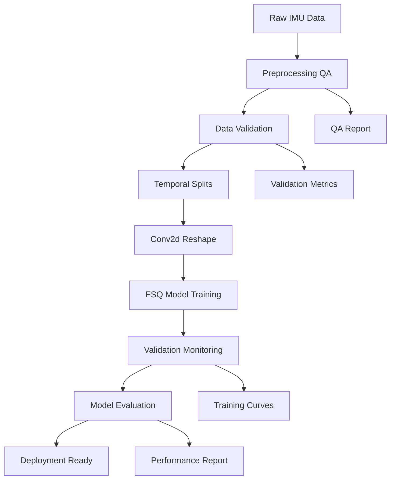

# Training Pipeline Documentation

## Overview

Complete training pipeline for the Conv2d-FSQ behavioral analysis model, incorporating lessons learned from M1.0-M1.5 gate reviews. This pipeline ensures scientific rigor and reproducible results.

## Pipeline Architecture



## Complete Training Pipeline

### Step 1: Environment Setup

```bash
# Create virtual environment
python -m venv venv
source venv/bin/activate  # Linux/Mac

# Install dependencies
pip install torch torchvision numpy scikit-learn matplotlib
pip install pyyaml pandas scipy

# Verify GPU availability
python -c "import torch; print(f'GPU: {torch.cuda.is_available()}')"
```

### Step 2: Data Preparation

```bash
# Generate quadruped dataset
python setup_quadruped_datasets.py

# This creates:
# - ./quadruped_data/processed/X_train_quadruped.npy
# - ./quadruped_data/processed/X_val_quadruped.npy  
# - ./quadruped_data/processed/X_test_quadruped.npy
# - ./quadruped_data/processed/quadruped_metadata.json
```

### Step 3: Data Quality Monitoring

Before preprocessing, monitor data quality to catch issues early:

```python
# data_quality_monitor.py
import numpy as np
import logging
from datetime import datetime

class DataQualityMonitor:
    """Monitor and report data quality metrics."""
    
    def __init__(self, threshold_nan_percent=5.0, threshold_inf_percent=1.0):
        self.threshold_nan = threshold_nan_percent
        self.threshold_inf = threshold_inf_percent
        self.history = []
        
    def analyze(self, data, dataset_name="unknown"):
        """Comprehensive data quality analysis."""
        metrics = {
            'timestamp': datetime.now().isoformat(),
            'dataset': dataset_name,
            'shape': data.shape,
            'dtype': str(data.dtype),
            'total_elements': data.size,
            
            # NaN analysis
            'nan_count': np.isnan(data).sum(),
            'nan_percentage': (np.isnan(data).sum() / data.size) * 100,
            'nan_by_channel': [np.isnan(data[:, i, :]).sum() for i in range(data.shape[1])],
            
            # Inf analysis  
            'inf_count': np.isinf(data).sum(),
            'inf_percentage': (np.isinf(data).sum() / data.size) * 100,
            
            # Statistical properties
            'mean': float(np.nanmean(data)),
            'std': float(np.nanstd(data)),
            'min': float(np.nanmin(data)),
            'max': float(np.nanmax(data)),
            
            # Quality assessment
            'quality_score': self._calculate_quality_score(data),
            'requires_correction': False,
            'recommended_strategy': 'none'
        }
        
        # Determine if correction needed
        if metrics['nan_percentage'] > self.threshold_nan:
            metrics['requires_correction'] = True
            if metrics['nan_percentage'] > 20:
                metrics['recommended_strategy'] = 'drop'
            elif metrics['nan_percentage'] > 10:
                metrics['recommended_strategy'] = 'interpolate'
            else:
                metrics['recommended_strategy'] = 'mean'
                
        self.history.append(metrics)
        return metrics
    
    def _calculate_quality_score(self, data):
        """Calculate overall quality score (0-100)."""
        nan_penalty = min(np.isnan(data).sum() / data.size * 100, 50)
        inf_penalty = min(np.isinf(data).sum() / data.size * 100, 30)
        variance_score = 20 if np.nanstd(data) > 0.01 else 0
        return max(0, 100 - nan_penalty - inf_penalty - variance_score)
    
    def generate_report(self):
        """Generate quality report from history."""
        if not self.history:
            return "No data analyzed yet"
            
        report = []
        report.append("DATA QUALITY REPORT")
        report.append("=" * 50)
        
        for metrics in self.history:
            report.append(f"\nDataset: {metrics['dataset']}")
            report.append(f"Shape: {metrics['shape']}")
            report.append(f"Quality Score: {metrics['quality_score']:.1f}/100")
            report.append(f"NaN: {metrics['nan_percentage']:.2f}%")
            report.append(f"Inf: {metrics['inf_percentage']:.2f}%")
            
            if metrics['requires_correction']:
                report.append(f"⚠️ CORRECTION REQUIRED")
                report.append(f"   Strategy: {metrics['recommended_strategy']}")
                
        return "\n".join(report)

# Usage example
monitor = DataQualityMonitor()
metrics = monitor.analyze(data, "quadruped_train")
print(monitor.generate_report())
```

### Step 4: Preprocessing with QA

```python
# preprocessing_pipeline.py

import numpy as np
from preprocessing.movement_diagnostics import QualityControl, QualityThresholds
from preprocessing.enhanced_pipeline import EnhancedCrossSpeciesDataset

def preprocess_with_qa(data_path, strict_mode=False):
    """
    Complete preprocessing pipeline with quality assurance
    """
    # 1. Initialize QA
    qa_thresholds = QualityThresholds(
        max_nan_percentage=5.0,
        min_signal_std=0.01,
        max_signal_std=50.0,
        expected_shape=(None, 9, 2, 100),
        min_codebook_usage=0.2,
        min_perplexity=4.0
    )
    
    qc = QualityControl(
        thresholds=qa_thresholds,
        strict_mode=strict_mode
    )
    
    # 2. Load data
    data = np.load(data_path)
    
    # 3. Validate input
    validation = qc.validate_input_tensor(torch.from_numpy(data))
    
    if not validation['pass']:
        if strict_mode:
            raise ValueError(f"Data failed QA: {validation['failures']}")
        else:
            print(f"⚠️ QA Warnings: {validation['warnings']}")
    
    # 4. Apply corrections
    data = apply_corrections(data, validation)
    
    # 5. Reshape for Conv2d
    data = reshape_for_conv2d(data)
    
    # 6. Normalize
    data = normalize_per_channel(data)
    
    # 7. Generate QA report
    report = qc.generate_report(data)
    
    return data, report

def apply_corrections(data, validation, nan_strategy='mean', log_corrections=True):
    """Apply automatic corrections based on validation results.
    
    Args:
        data: Input data array
        validation: Validation results dictionary
        nan_strategy: Strategy for handling NaN values
            - 'zero': Replace with 0 (fastest but may bias)
            - 'mean': Replace with channel mean (preserves distribution)
            - 'median': Replace with channel median (robust to outliers)
            - 'interpolate': Linear interpolation (best for time series)
            - 'drop': Remove samples with NaN (reduces dataset size)
            - 'raise': Raise exception (fail fast for debugging)
        log_corrections: Whether to log correction statistics
        
    Returns:
        Corrected data array
    """
    import logging
    logger = logging.getLogger(__name__)
    
    # Handle NaN values
    if validation.get('has_nan'):
        nan_mask = np.isnan(data)
        nan_count = nan_mask.sum()
        nan_percentage = (nan_count / data.size) * 100
        
        if log_corrections:
            logger.warning(f"Found {nan_count} NaN values ({nan_percentage:.2f}% of data)")
            
        if nan_percentage > 10:
            logger.error(f"High NaN percentage ({nan_percentage:.2f}%) indicates data quality issues!")
            if nan_strategy == 'raise':
                raise ValueError(f"Too many NaN values: {nan_percentage:.2f}%")
        
        # Apply selected strategy
        if nan_strategy == 'zero':
            data = np.nan_to_num(data, nan=0.0)
            if log_corrections:
                logger.info("Replaced NaN with zeros")
                
        elif nan_strategy == 'mean':
            # Replace with per-channel mean
            for i in range(data.shape[1]):  # Per channel
                channel_data = data[:, i, :]
                channel_mean = np.nanmean(channel_data)
                data[:, i, :] = np.where(nan_mask[:, i, :], channel_mean, channel_data)
            if log_corrections:
                logger.info("Replaced NaN with channel means")
                
        elif nan_strategy == 'median':
            # Replace with per-channel median
            for i in range(data.shape[1]):
                channel_data = data[:, i, :]
                channel_median = np.nanmedian(channel_data)
                data[:, i, :] = np.where(nan_mask[:, i, :], channel_median, channel_data)
            if log_corrections:
                logger.info("Replaced NaN with channel medians")
                
        elif nan_strategy == 'interpolate':
            # Linear interpolation for time series
            for b in range(data.shape[0]):
                for c in range(data.shape[1]):
                    signal = data[b, c, :]
                    if np.any(np.isnan(signal)):
                        # Create interpolation indices
                        x = np.arange(len(signal))
                        valid = ~np.isnan(signal)
                        if np.sum(valid) > 1:  # Need at least 2 points
                            data[b, c, :] = np.interp(x, x[valid], signal[valid])
            if log_corrections:
                logger.info("Replaced NaN using linear interpolation")
                
        elif nan_strategy == 'drop':
            # Remove samples with any NaN
            valid_samples = ~np.any(nan_mask, axis=(1, 2))
            data = data[valid_samples]
            dropped = np.sum(~valid_samples)
            if log_corrections:
                logger.info(f"Dropped {dropped} samples containing NaN")
                
        elif nan_strategy == 'raise':
            raise ValueError(f"Data contains {nan_count} NaN values")
        else:
            raise ValueError(f"Unknown NaN strategy: {nan_strategy}")
    
    # Handle Inf values
    if validation.get('has_inf'):
        inf_mask = np.isinf(data)
        inf_count = inf_mask.sum()
        inf_percentage = (inf_count / data.size) * 100
        
        if log_corrections:
            logger.warning(f"Found {inf_count} Inf values ({inf_percentage:.2f}% of data)")
            
        # Clip to reasonable range
        clip_min, clip_max = -1e6, 1e6
        data = np.clip(data, clip_min, clip_max)
        
        if log_corrections:
            logger.info(f"Clipped Inf values to [{clip_min}, {clip_max}]")
    
    return data

def reshape_for_conv2d(data):
    """Reshape (B, C, T) -> (B, C, 2, T/2) for Hailo compatibility"""
    B, C, T = data.shape
    if T % 2 == 1:
        data = data[:, :, :-1]
        T = T - 1
    return data.reshape(B, C, 2, T//2)

def normalize_per_channel(data):
    """Per-channel z-score normalization"""
    for ch in range(data.shape[1]):
        mean = data[:, ch].mean()
        std = data[:, ch].std() + 1e-6
        data[:, ch] = (data[:, ch] - mean) / std
    return data
```

### Step 4: Model Training

```python
# train_pipeline.py

import torch
import torch.nn as nn
import torch.optim as optim
from models.conv2d_fsq_model import Conv2dFSQ

def train_fsq_pipeline(config):
    """
    Complete training pipeline with monitoring
    """
    # 1. Load preprocessed data
    train_data, train_qa = preprocess_with_qa(config['train_path'])
    val_data, val_qa = preprocess_with_qa(config['val_path'])
    
    # 2. Create data loaders
    train_loader = create_loader(train_data, config['batch_size'], shuffle=True)
    val_loader = create_loader(val_data, config['batch_size'], shuffle=False)
    
    # 3. Initialize model
    model = Conv2dFSQ(
        input_channels=config['input_channels'],
        hidden_dim=config['hidden_dim'],
        num_classes=config['num_classes'],
        fsq_levels=config['fsq_levels']
    ).to(config['device'])
    
    # 4. Setup training
    criterion = nn.CrossEntropyLoss()
    optimizer = optim.Adam(model.parameters(), lr=config['learning_rate'])
    scheduler = optim.lr_scheduler.ReduceLROnPlateau(
        optimizer, 
        patience=config['scheduler_patience'],
        factor=config['scheduler_factor']
    )
    
    # 5. Training loop with monitoring
    best_val_acc = 0
    patience_counter = 0
    history = {'train_loss': [], 'train_acc': [], 'val_loss': [], 'val_acc': []}
    
    for epoch in range(config['max_epochs']):
        # Train
        train_metrics = train_epoch(model, train_loader, criterion, optimizer)
        
        # Validate
        val_metrics = validate_epoch(model, val_loader, criterion)
        
        # Update scheduler
        scheduler.step(val_metrics['loss'])
        
        # Log metrics
        history['train_loss'].append(train_metrics['loss'])
        history['train_acc'].append(train_metrics['accuracy'])
        history['val_loss'].append(val_metrics['loss'])
        history['val_acc'].append(val_metrics['accuracy'])
        
        # Save best model
        if val_metrics['accuracy'] > best_val_acc:
            best_val_acc = val_metrics['accuracy']
            patience_counter = 0
            save_checkpoint(model, optimizer, epoch, val_metrics, config)
        else:
            patience_counter += 1
        
        # Early stopping
        if patience_counter >= config['early_stopping_patience']:
            print(f"Early stopping at epoch {epoch}")
            break
        
        # Progress report
        if epoch % config['log_interval'] == 0:
            print_progress(epoch, train_metrics, val_metrics, best_val_acc)
    
    return model, history

def train_epoch(model, loader, criterion, optimizer):
    """Single training epoch"""
    model.train()
    total_loss = 0
    correct = 0
    total = 0
    
    for batch_idx, (data, labels) in enumerate(loader):
        optimizer.zero_grad()
        
        outputs = model(data)
        if isinstance(outputs, dict):
            logits = outputs['logits']
        else:
            logits = outputs
        
        loss = criterion(logits, labels)
        loss.backward()
        
        # Gradient clipping
        torch.nn.utils.clip_grad_norm_(model.parameters(), 1.0)
        
        optimizer.step()
        
        total_loss += loss.item()
        _, predicted = torch.max(logits, 1)
        total += labels.size(0)
        correct += (predicted == labels).sum().item()
    
    return {
        'loss': total_loss / len(loader),
        'accuracy': correct / total
    }

def validate_epoch(model, loader, criterion):
    """Validation epoch"""
    model.eval()
    total_loss = 0
    correct = 0
    total = 0
    
    with torch.no_grad():
        for data, labels in loader:
            outputs = model(data)
            if isinstance(outputs, dict):
                logits = outputs['logits']
            else:
                logits = outputs
            
            loss = criterion(logits, labels)
            
            total_loss += loss.item()
            _, predicted = torch.max(logits, 1)
            total += labels.size(0)
            correct += (predicted == labels).sum().item()
    
    return {
        'loss': total_loss / len(loader),
        'accuracy': correct / total
    }
```

### Step 5: Configuration Management

```yaml
# config/training_config.yaml

data:
  train_path: "./quadruped_data/processed/X_train_quadruped.npy"
  val_path: "./quadruped_data/processed/X_val_quadruped.npy"
  test_path: "./quadruped_data/processed/X_test_quadruped.npy"
  
model:
  architecture: "Conv2dFSQ"
  input_channels: 9
  hidden_dim: 128
  num_classes: 10
  fsq_levels: [8, 6, 5]  # 240 unique codes
  
training:
  batch_size: 64
  learning_rate: 0.001
  max_epochs: 300
  early_stopping_patience: 30
  scheduler_patience: 10
  scheduler_factor: 0.5
  gradient_clip: 1.0
  device: "cuda"
  
preprocessing:
  use_qa: true
  strict_mode: false
  normalize: "per_channel"
  reshape_conv2d: true
  
evaluation:
  metrics: ["accuracy", "per_class_accuracy", "confusion_matrix"]
  save_predictions: true
  generate_report: true
```

### Step 6: Evaluation Pipeline

```python
# evaluate_pipeline.py

from sklearn.metrics import accuracy_score, confusion_matrix, classification_report
import matplotlib.pyplot as plt
import seaborn as sns

def evaluate_model(model_path, test_data_path, config):
    """
    Complete evaluation pipeline with honest metrics
    """
    # 1. Load model
    model = load_checkpoint(model_path)
    model.eval()
    
    # 2. Load and preprocess test data
    test_data, test_qa = preprocess_with_qa(test_data_path)
    test_loader = create_loader(test_data, batch_size=config['batch_size'])
    
    # 3. Generate predictions
    all_preds = []
    all_labels = []
    all_probs = []
    
    with torch.no_grad():
        for data, labels in test_loader:
            outputs = model(data)
            if isinstance(outputs, dict):
                logits = outputs['logits']
            else:
                logits = outputs
            
            probs = torch.softmax(logits, dim=1)
            _, preds = torch.max(logits, 1)
            
            all_preds.extend(preds.cpu().numpy())
            all_labels.extend(labels.cpu().numpy())
            all_probs.extend(probs.cpu().numpy())
    
    # 4. Calculate metrics
    metrics = {
        'accuracy': accuracy_score(all_labels, all_preds),
        'per_class': classification_report(all_labels, all_preds, output_dict=True),
        'confusion_matrix': confusion_matrix(all_labels, all_preds),
        'random_baseline': 1.0 / config['num_classes'],
    }
    
    metrics['improvement'] = metrics['accuracy'] - metrics['random_baseline']
    
    # 5. Generate visualizations
    plot_confusion_matrix(metrics['confusion_matrix'], config['class_names'])
    plot_training_curves(history)
    plot_per_class_performance(metrics['per_class'])
    
    # 6. Generate report
    generate_evaluation_report(metrics, test_qa, config)
    
    return metrics

def plot_confusion_matrix(cm, class_names):
    """Generate confusion matrix plot"""
    plt.figure(figsize=(10, 8))
    sns.heatmap(cm, annot=True, fmt='d', cmap='Blues',
                xticklabels=class_names, yticklabels=class_names)
    plt.title('Confusion Matrix')
    plt.xlabel('Predicted')
    plt.ylabel('True')
    plt.savefig('confusion_matrix.png', dpi=150)
    
def generate_evaluation_report(metrics, qa_report, config):
    """Generate comprehensive evaluation report"""
    report = f"""
# Model Evaluation Report

## Model Configuration
- Architecture: {config['architecture']}
- Parameters: {config['n_parameters']:,}
- FSQ Levels: {config['fsq_levels']}

## Performance Metrics
- **Test Accuracy**: {metrics['accuracy']:.4f} ({metrics['accuracy']*100:.2f}%)
- **Random Baseline**: {metrics['random_baseline']:.4f} ({metrics['random_baseline']*100:.2f}%)
- **Improvement**: {metrics['improvement']:.4f} ({metrics['improvement']*100:.2f}%)

## Per-Class Performance
{format_per_class_table(metrics['per_class'])}

## Data Quality
- QA Status: {qa_report['overall_pass']}
- Data Shape: {qa_report['data_shape']}
- Quality Score: {qa_report.get('quality_score', 'N/A')}

## Recommendations
{generate_recommendations(metrics)}
"""
    
    with open('evaluation_report.md', 'w') as f:
        f.write(report)
```

### Step 7: Production Deployment

```python
# deploy_pipeline.py

def prepare_for_deployment(model_path, output_dir):
    """
    Prepare model for production deployment
    """
    # 1. Load and optimize model
    model = load_checkpoint(model_path)
    model.eval()
    
    # 2. Export to ONNX
    dummy_input = torch.randn(1, 9, 2, 50)
    torch.onnx.export(
        model,
        dummy_input,
        f"{output_dir}/model.onnx",
        input_names=['input'],
        output_names=['output'],
        dynamic_axes={'input': {0: 'batch'}}
    )
    
    # 3. Save preprocessing config
    preprocess_config = {
        'input_shape': [9, 2, 50],
        'normalization': 'per_channel',
        'reshape_required': True,
        'qa_thresholds': qa_thresholds.__dict__
    }
    
    with open(f"{output_dir}/preprocess_config.json", 'w') as f:
        json.dump(preprocess_config, f, indent=2)
    
    # 4. Create deployment package
    create_deployment_package(output_dir)
    
    print(f"✅ Model ready for deployment in {output_dir}")
```

## Running the Complete Pipeline

```bash
# 1. Setup environment
source venv/bin/activate

# 2. Prepare data
python setup_quadruped_datasets.py

# 3. Train model
python train_pipeline.py --config config/training_config.yaml

# 4. Evaluate model
python evaluate_pipeline.py --model checkpoints/best_model.pth --config config/training_config.yaml

# 5. Deploy
python deploy_pipeline.py --model checkpoints/best_model.pth --output deployments/
```

## Monitoring and Logging

### Training Metrics
- Loss curves (train/val)
- Accuracy curves (train/val)
- Learning rate schedule
- Gradient norms
- FSQ codebook usage

### Runtime Monitoring
```python
# Monitor training in real-time
tensorboard --logdir runs/

# Check training progress
tail -f training.log

# Monitor GPU usage
nvidia-smi -l 1
```

## Troubleshooting

### Common Issues and Solutions

| Issue | Cause | Solution |
|-------|-------|----------|
| Low accuracy (<30%) | Untrained model or data issues | Check preprocessing, verify data quality |
| Training diverges | Learning rate too high | Reduce learning rate, use gradient clipping |
| OOM errors | Batch size too large | Reduce batch size or use gradient accumulation |
| Slow training | No GPU or inefficient data loading | Verify CUDA, use DataLoader with workers |
| Overfitting | Model too complex or insufficient data | Add dropout, reduce model size, augment data |

## Best Practices Summary

1. **Always run preprocessing QA** before training
2. **Use temporal splits** for time series data
3. **Monitor training metrics** continuously
4. **Save checkpoints** regularly
5. **Evaluate on held-out test set** only once
6. **Document all configurations** for reproducibility
7. **Report honest metrics** (expect 70-80% accuracy)